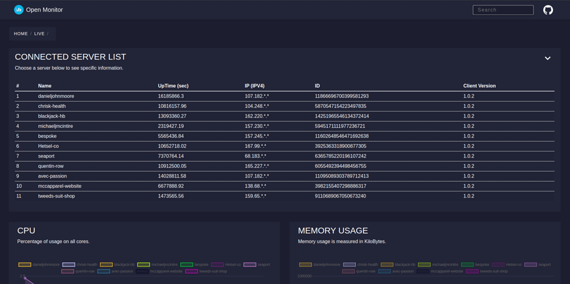

# Open Monitor
Open Monitor is a server infrastructure tool used to monitor server instances.



### Startup
Clone the repo, and follow the instructions below
```
git clone https://github.com/Open-Monitor/dmon.git
cd dmon/
```

#### Elastic-Search (Docker)
To start, please first by downloading docker on your respectful system. After docker is installed, run `./docker-elastic-build.sh` in your terminal. After, elastic search should be successfully dockerized.

#### Host-Monitor
Before starting the host monitor service, please have an elastic search instance running.

To run the host monitor, please ensure that nodeJs is installed on your machine. After, run `npm i` to install all of the dependencies required to run the service, then `npm start` to start the service.

#### Client-Monitor
After elastic search and the host-monitor is running, install the client-monitor on the target server.

Edit config.js with the IP address of the target host-server, and run `./client`, or `nohup ./client &` to run the service in the background without ssh interruption.
The client-monitor was compiled on Ubuntu 18.04, and some older versions of Ubuntu 16.04 will require libstdc++ version GLIBCXX_3.4.22 which can be installed by following the instructions [here](https://github.com/lhelontra/tensorflow-on-arm/issues/13#issuecomment-418202182).

### Usage

#### Local Machine
To run on your local machine, start by cloning the repo and getting the host-monitor and web server running. If you followed the instructions above you should begin to see information populating on localhost:3000.
```
cd /host-monitor
npm i && npm start

cd /dmon-web
npm i && npm start
```
Next you want to start the client-monitor.
```
cd metrics-agent/
./client
```
You should begin to see the web-server receiving information, and graphs will begin to populate.

#### External Machine
Follow the same instructions as above, except you will need to change the IPs in the relevant config files.
The metrics-agent should contain the public IP:PORT of the target host-monitor.

The host-monitor's IP should be it's local IP. You may need to configure your network with port-forwarding.

### Troubleshooting
You may run into some issues with getting three different services set up.

1. If all the services started without failure but the client is printing "Stream rpc failed" it typically means there is an issue with the IP addresses of the client and host-monitor.
    1. If you are running both services on a local device. Make sure the ip's are `localhost:50486` and port 50486 is open.
    2. If you are running the host-service on your local device and the ./client on an external machine. Please check the section above. It is important that you have opened and forwared a port in your router configuration. The port-forwarding rule should take your public IP -> computer's local IP. The client's configuration should contain your host-monitor's public IP and open Port.
2. The host-monitor, or web-client are failing to start.
    1. The most common issue is missing dependencies, remember to run `npm i` in in their respective folders.
3. The ./client is missing XX library.
    1. Most of the libraries that are required are statically linked (grpc, protobufs, pthread) but you system may be missing some. Look up information regarding installing the specifc library. If all else fails, please open an issue.

If non of the above are related to your issue, feel free to open an issue.

### Deployment Model
View deployment model [here](./docs/deployment-model.md)

### Contributing
Contributions are greatly encouraged. Please make a pull-request.
